<h2 align=center>syntactic sugar مجرد Arrow function هل ال</h2>


<details dir=rtl>
  <summary>
    <h2>الاجابة</h2>
  </summary>

  ال Arrow function هي طريقة تانية لكتابة ال regular function و ال syntax بتاعها هو:-
  ```javascript
   (arg1,arg2,...,argN) => expression
  ```
 طيب هو احنا كنا عايزين حاجة زي ال Arrow Function دي لي ؟ `لسببين`
 ```mermaid
  flowchart TD
    B["fab:fa-twitter Arrow function ال"]
    B-->C(this keyword بتحل المشكلة الأزلية لل )
    B-->E[ regular function لل Syntactic Sugar تعتبر]
```
  


هنبدأ دلوقتي نشرح كل سبب بالتفصيل...
  
### أولا: انها syntactic sugar 
 
ال arrow function تعتبر short syntax و concise و بتوفر علينا ال Boilerplate code بتاع ال regular function و في شوية rules لازم تتبعها عشان تكتب ال arrow function و هي:
  - لازم نعملها assign ل variable معين أو نستخدمها ك callback [يعني مينفعش أعملها define علطول زي ال regular function]
  ```javascript
  
  // assign to a variable
let func = (arg1,arg2,...,argN)=> expression

// pass as a callback
[...].map((arg1,arg2,...,argN)=> expression)
  
  ```
  
  - عدد ال params لو كان: 
    - 1 بس فال ( ) هيكونوا اختياري 
    - أكتر من 1  فال ( ) هيكونوا اجباري
    - من غير Params خالص فأنت ممكن
        - تسيب ال ( ) فاضيين
        - تحط underscore بالشكل دا ( _ ) أو _

  
  ```javascript
  

  const func = (x) => expression  أو   const func = x => expression
  const func = (x,y,z) => expression
  const func = ()=> expression أو const func = _ => expression أو const func = (_)=> expression
  ```
 - عدد ال statements جوا ال function body لو كان:
    - كتير : فبستخدم ال {} و return keyword يعني ال return هنا هيكون نوعهاexplicit return
    - واحده بس : فأقدر أستغني عن ال {} و return keyword يعني ال return هنا هيكون نوعها implicit return
    

  
  
  
```javascript
 const func = (x,y,z) => {
    // statement 1
    // statement 2
  return x+y+z;  // explicit return
  }
  const func = (x,y,z) => x + y + z; // implicit return
```
  
  - في حالة ال implicit return لو هنعمل return ل object فهنا لازم نحط ال object دا جوا ( ) بالشكل دا:
 
  ```javascript
  const func = () => ( {name: 'Ali'} )
  ```
  و برده في ال React لما نيجي نعمل return ل jsx object بنحطه جوا ( ) 
  ```JSX
  policy.values.map(value => {
    return (
      <Form.Field key={ value.name }>
         <label>{ value.displayName || value.name }</label>
          <Checkbox toggle />
      </Form.Field> )
  }
  ```
  

### ثانيا: انها حلت مشكلة ال this keyword

  في الأول خلينا نعرف اي هي مشكلة ال `this` الي بنتكلم عليها...
  لو بصيت علي الكود دا
  ```js
  
  let group = {
    title: "our group",
    students: ["Ali", "Mohamed", "Akram"],
    showList (){
      🟢this.students.forEach(function func(student){
        console.log(🔴this.title + ": " + student)
      })
    }
  }
  
  group.showList(); // "undefined: Ali" then "undefined: Mohamed" then "undefined: Akram"

  ```
  في هنا Unexpected Error حصل و هو ان ال this.title بترجع undefined... طب اي السبب ؟
 
   &#x21A2;
ال this الاولي الي جنبها 🟢 مختلفة عن ال this الثانية الي جنبها 🔴 و دا لأن ال 
  - ال `this` الاولي موجودة في ال context بتاع ال group object و بالتالي ال `this` هنا بتشير الي ال group object
  - بينما ال `this` الثانية موجودة في ال Global context و بالتالي ال `this` دي بتشير الي ال window object
  
  طب هل ال title موجود جوا ال window object ؟ الاجابة لأ و دا لأن ال title مش متعرف في ال global context و بالتالي ال
  ```javascript
  this.title === window.title === undefined
  ```
  
  طب ثواني...
  احنا عرفنا نحدد ال context بتاع كل this ازاي ؟ 
  
  لو بصيت علي المثال مرة ثانية هتلاقي ان
  - ال this الاولي معمولها implicit binding بال group object بالشكل دا => `()group.showList` و بالتالي ال this دي هتعود علي ال group object. 
  - ال this الثانية موجودة جوا function و احنا عارفين ان ال js functions بيحصلها Hoisting **خلينا نقول دلوقتي مجازا أن ال Hoisting معناها ان ال functions بيحصلها رفع في ال global context** بالشكل دا:
  
  
  ```javascript
 function func(student){
    alert (🔴this.title + ": " + student)
  }
  ↑ ↑ ↑
  
  let group = {
    title: "our group",
    students: ["Ali", "Mohamed", "Akram"],
    showList (){
      this.students.forEach(func)
    }
  }
  ```
  و نتيجة لل Hoisting دا فال this🔴 دي هتشير الي ال Global context الي هو ال window object و عشان ال window object مش موجود جواه property اسمها title فهيدي undefined
  
  
 ----
  احنا كدا عرفنا المشكلة بتاع ال this keyword... ازاي بقا نقدر نحلها ؟
  
  عشان نحل المشكلة دي فأحنا محتاجين نخلي ال this🔴 الثانية يكون ليها نفس ال context بتاع ال this🟢 الاولي... طب هنعمل دا ازاي ؟؟؟
  
   ```mermaid
  flowchart TD
    B["عندنا 3 حلول"]
    B-->C(" Arrow Function نستخدم ال ")
    B-->D(" bind/call/apply methods بال Explicit Binding نعمل ")
    B-->E(" في متغير this نخزن قيمة ال ")
```
  
  
  
 #### 1- هنحتفظ بقيمة ال this🟢 الاولي في variable بالشكل دا 
  
```javascript
 function func(student){
    alert (that.title + ": " + student)
  }
  
  let group = {
    title: "our group",
    students: ["Ali", "Mohamed", "Akram"],
    showList (){
      that = this; (❗)
      this.students.forEach(func)
    }
  }
  ```
 في السطر الي فيه العلامه دي (❗) احنا عملنا assign لقيمة ال this بتاعت ال group context في ال that variable و بكدا أقدر استخدم ال context دا في أي مكان و دا معناه ان ال
  ```javascript
  that.title === group.title === "our group"
  ```
  
  
#### 2- هنعمل explicit binding باستخدام ال bind method بالشكل دا:
```javascript
 function func(student){
    alert (this.title + ": " + student)
  }
  
  let group = {
    title: "our group",
    students: ["Ali", "Mohamed", "Akram"],
    showList (){
      this.students.forEach(func.bind(this)) (❗)
    }
  }
```
  
  
#### 3- هنستخدم ال Arrow Function بالشكل دا:

```javascript
  let group = {
    title: "our group",
    students: ["Ali", "Mohamed", "Akram"],
    showList (){
      this.students.forEach(student => console.log(this.title + ": " + student) ) (❗)
    }
  }
```

من مميزات ال arrow function انها مش بتتعامل ك context و بالتالي مفيهاش لا `this` ولا `arguments` ولا `prototype` ولا `yield` ولا `()super` و بالتالي الي بيحصل ان ال value of these keywords بتتأخذ من ال outer context الي شايل ال arrow function.
  
> عشان نفهم السطر الي فوق دا قأحنا محتاجين نقرأ المقال دا الأول [ازاي ال js بتشتغل](https://github.com/Ak-ram/Frontend-Interview-Questions/blob/master/javascript/%D8%A8%D8%AA%D8%B4%D8%AA%D8%BA%D9%84%20JS%20%D8%A7%D8%B2%D8%A7%D9%8A%20%D8%A7%D9%84.md)

 في السطر الي فيه العلامه دي (❗) ال this value الي جوا ال arrow function هتتأخذ من ال outer context الي هو group object
  
  كدا شرحنا السببين الي عشانهم تم انشاء ال Arrow Function
  ---
  
  هل بقا ال Arrow Function تعتبر بديل لل Regular Function ؟
  
  طبعا لأ... ودا لأن ال arrow function أتعملت أصلا عشان تكون "single use" بمعني أنها تعتبر short و concise و كمان مناسية جدا أني أستخدمها ك   callback مع ال `()forEach` و ال `()map` عشان مشكلة ال this... بس في نفس الوقت ليها limitaions كثيرة زي:- 

```mermaid
  graph RL
    A["Arrow Function Limitations"]
    A --> C(Generator Function و بالتالي مقدرش أستخدمها ك yield )
    A --> D(كبديل spread operator و بالتالي بتستخدم ال arguments)
    A --> E(Round Rect)
    A --> F(Round Rect)
    A --> G(Round Rect)

```
  
  

  

  
  
</details>


